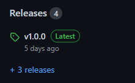
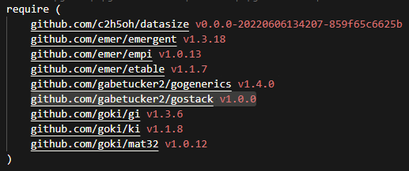
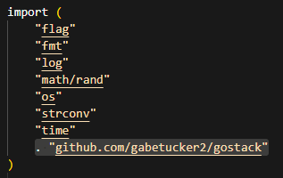

 <h1>PREFACE</h1>


 *"The purpose of abstraction is not to be vague, but to create a new semantic level in which one can be absolutely precise." - Edsger W. Dijkstra*

 <h1>Introduction</h1>

 ***Go***, despite its elegance, can be excruciating.  We often find ourselves writing tedious code to complete conceptually simple tasks, adding a layer of complexity that distracts from the goal.  ***gostack***'s novel approach to data management abstracts this layer of complexity into all-purpose, intuitive functions so that you can focus more on what matters.


 ***gostack*** introduces two new structs—the **Card** and the **Stack**—which intend to evoke the image of a stack of cards.  **Stacks**, which replace arrays, maps, and matrices, contain a set of **Cards**.  **Cards** can store **Stacks** (which are in turn called **Substacks**), thereby making **Stacks** a recursive data structure.  This allows ***gostack***'s functions to...

 * abstract away for-loops, if-statements, and recursive functions
 * seamlessly translate between **Stacks** and existing arrays, maps, and matrices
 * filter through **Cards** in a **Stack** by any desired search criteria
 * dynamically update **Cards** within a **Stack** according to those criteria
 * effortlessly print all relevant information surrounding a **Card** or a **Stack** to facilitate debugging
 * create additional avenues through which any problem can be approached

 <h1>Sample Code</h1>

 Let's get a sense of what ***gostack*** looks like.  In order to make a **Stack** from an existing map structure, you would do:

 ```
 existingMap := map[string]string {"Kid":"Tommy", "Adult":"Chuck", "Adult":"Joey"}
 kidsAndAdults := MakeStack(existingMap)
 ```

 In order to get all people in that **Stack** who are adults, you would do:

 ```
 adults := kidsAndAdults.GetMany(FIND_Key, "Adult")
 ```

 Now, to update the key of every adult from "Adult" to 4, we would do:

 ```
 adults.UpdateMany(REPLACE_Key, 4, FIND_All)
 ```

 And to multiply the key of an adult by 3 if and only if its order (1, 2, ..., n) in the adults **Stack** is even:

 ```
 adults.UpdateMany(REPLACE_Lambda, func(card *Card) {
  card.Key = card.Key.(int) * 3
 }, FIND_Lambda, func(card *Card) (bool) {
  return (card.Idx + 1) % 2 == 0
 })
 ```

 <h1>Installation</h1>

 1. Edit your **go.mod** file
   
    *([or add one if you haven't already](https://go.dev/doc/tutorial/create-module))*
 2. Add `github.com/gabetucker2/gostack [release version]` to the **go.mod**'s **require** clause

 
 

 3. Type `go mod tidy` in your terminal
 
    *(ensuring that **go.mod** is a direct child of your current directory)*

 4. Add `. "github.com/gabetucker2/gostack"` to the **imports** of every file in which you would like to use ***gostack***

 

 <h1>General Information</h1>

 Is ***gostack*** really more efficient than ***native Go***?  To put this to the test, we created a race for the two where they each have to complete 3 data management tasks.  While ***native Go*** took 61 lines to finish, ***gostack*** [took merely 9!](/documentation/race.md)

 To get a better feel of the library, feel free to take a look at some [examples](/tutorials/Bootstrap.go) of how ***gostack*** can substitute commonly-used functions.  Alternatively, take a look at our beginner-friendly [introductory tutorial](/tutorials/Introduction.go)!

<h2>Footer</h1>

 This library was created chiefly by Gabe Tucker [[email](mailto:tucker.854@osu.edu)/[LinkedIn](https://www.linkedin.com/in/gabetucker2/)] with contributions from Patrick Da Silva [[email](mailto:dasilva.30@osu.edu)/[LinkedIn](https://www.linkedin.com/in/patrick-da-silva-871833225/)] and Andy Chen [[email](mailto:chenandy@usc.edu)] to facilitate coding a neural network model based in Go.

 If you have any suggestions, questions, or comments in respect to this project, please email me at [tucker.854@osu.edu](mailto:tucker.854@osu.edu).  I will usually respond within 1-2 business days.  Alternatively (and preferably), please join our [official Discord community](https://discord.gg/NmxxcKBVBU) devoted to helping users with gostack issues, announcing exciting updates, and streamlining communication between developers and users!

[Return to Glossary](#glossary)
