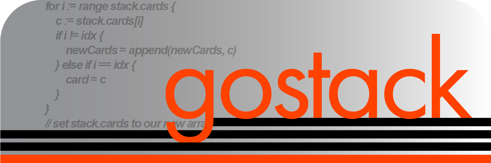

v1.0.4 — Beta Release — 11/13/2022 — Post-release polish

 *"The purpose of abstraction is not to be vague, but to create a new semantic level in which one can be absolutely precise." - Edsger W. Dijkstra*

 <h1>Glossary</h1>

 <h2>Introduction</h2>

 * [What is gostack?](documentation/introduction.md)
 * [How does gostack work?](documentation/overview.md)
 * [Frequently asked questions](documentation/faq.md)

 <h2>Documentation</h2>
 
  * [Enum documentation](documentation/enumsAPI.md)
  * [Struct documentation](documentation/structsAPI.md)
  * [Function documentation](documentation/functionsAPI.md)
  * [Meta documentation](documentation/metaAPI.md)

 <h2>Tutorials</h2>
 
  * [Installation tutorial](documentation/tutorials/installationTutorial.md)
  * [Introductory tutorial](documentation/tutorials/introductionTutorial.md)
  * [StackMatrix tutorial](documentation/tutorials/matricesTutorial.md)
  * [Lambda tutorial](documentation/tutorials/lambdaTutorial.md)
  * [Pointers tutorial](documentation/tutorials/pointersTutorial.md)

 <h2>General</h2>
 
 * [Timeline](documentation/timeline.md)
 * [Credits](documentation/credits.md)
 * [Support Us](documentation/support.md)
 * [How fast is gostack compared to native Go?](documentation/benchmark.md)
 * [How many lines does gostack save compared to native Go?](documentation/race.md)

 ---

 Join our [official Discord community](https://discord.gg/NmxxcKBVBU)!  It is devoted to helping users resolve ***gostack*** bugs and related issues, announcing exciting updates, making improvements based on user suggestions, and streamlining communication between developers and gostackers.  Although a fully functional release has been published, this is a growing project with many updates to come.
