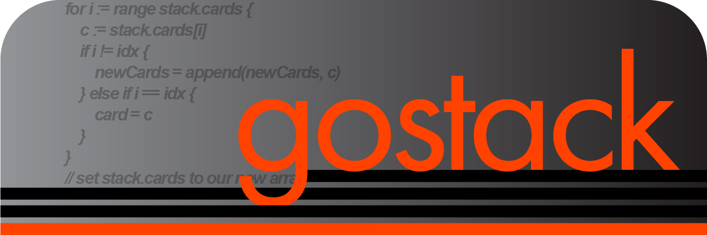
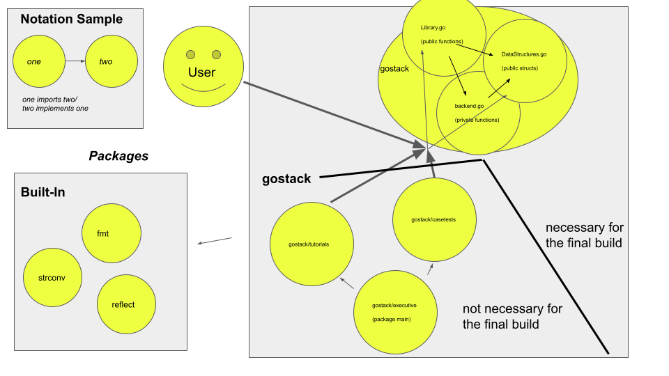

 <h1 name = "preface">PREFACE</h1>



 <h1 name = "introduction">Introduction</h1>

 Introducing **Stacks**—sets of **Card** elements (like a stack of cards)—***gostack*** serves as an all-in-one library for concise, parsimonious, and elegant data management in *golang*.

 ***gostack***'s stacks...
 * ...replace maps and arrays, removing the need for pesky index-key-value fetching or translating data between maps and arrays, all the while supporting smooth conversion between stacks and your existing maps and arrays
 * ...offer the minimum functions needed for unlimited flexibility, allowing the user to seamlessly write what would previously have been a verbose monstrosity of 4 nested for-loops in a single line
 * ...allow the user to get and set based on reference or object with ease, preventing the user from having to worry about convoluted pointer/address management
 * ..., even when our built-in functions aren't enough, allow the user to effortlessly implement their own lambda functions to create sorting mechanisms of their own design

 Is ***gostack*** really more efficient than ***classical go***?  To put this to the test, we created a race for the two; they each have to complete 3 data management tasks as quickly and efficiently as possible.  Whereas ***classical go*** took 45 lines to make it to the finish, ***gostack*** took roughly one fifth the amount of lines (merely 10)—[see for yourself!](/tutorials/race.md)

 To get a better feel of the library, feel free to take a look at some [examples](/tutorials/bootstrap.go) of how ***gostack*** can substitute commonly-used functions.

<h1 name = "glossary">Glossary</h1>

 > [Files](#files)

 > [Preface](#preface)
 >> [Introduction](#introduction)
 >
 >> [Glossary](#glossary)
 >
 >> [File Explanations](#fileExplanations)
 >
 >> [Conventions](#conventions)

 > [Overview](#overview)
 >> [Brief Documentation](#briefDocumentation)
 >>> [Data Structures](#dataStructuresBrief)
 >>>> [structs](#structsBrief)
 >>>
 >>>> [enums](#enumsBrief)
 >>>
 >>> [Non-Generalized Functions](#nonGeneralizedFunctionsBrief)
 >>>
 >>> [Generalized Functions](#generalizedFunctionsBrief)
 >
 >> [Exhaustive Documentation](#exhaustiveDocumentation)
 >>> [Data Structures](#dataStructures)
 >>>> [structs](#structs)
 >>>>> [Stack](#stack)
 >>>>
 >>>>> [Card](#card)
 >>>>
 >>>> [enums](#enums)
 >>>>> [RETURN](#RETURN)
 >>>>
 >>>>> [POSITION](#POSITION)
 >>>>
 >>>>> [TYPE](#TYPE)
 >>>>
 >>>>> [ORDER](#ORDER)
 >>>>
 >>>>> [MATCH](#MATCH)
 >>>
 >>> [Non-Generalized Functions](#nonGeneralizedFunctions)
 >>>> [MakeCard(...)](#MakeCard)
 >>>
 >>>> [MakeStack(...)](#MakeStack)
 >>>
 >>>> [stack.Empty()](#Empty)
 >>>
 >>>> [{card, stack}.Clone()](#Clone)
 >>>
 >>>> [stack.Unique()](#Unique)
 >>>
 >>>> [stack.ToArray()](#ToArray)
 >>>
 >>>> [stack.ToMap()](#ToMap)
 >>>
 >>>> [stack.Shuffle()](#Shuffle)
 >>>
 >>>> [stack.Flip()](#Flip)
 >>>
 >>>> [{card, stack}.Print()](#Print)
 >>>
 >>> [Generalized Functions](#generalizedFunctions)
 >>>> [stack.Add(...)](#Add)
 >>>
 >>>> [stack.Replace(...)](#Replace)
 >>>>
 >>>> [stack.ReplaceMany(...)](#ReplaceMany)
 >>>
 >>>> [stack.Extract(...)](#Extract)
 >>>>
 >>>> [stack.ExtractMany(...)](#ExtractMany)
 >>>
 >>>> [stack.Move(...)](#Move)
 >>>
 >>>> [stack.Get(...)](#Get)
 >>>>
 >>>> [stack.GetMany(...)](#GetMany)
 >>>
 >>>> [stack.Has(...)](#Has)
 >
 >> [Future Updates](#futureUpdates)
 >
 >> [Footer](#footer)

<h1 name = "fileExplanations">File Explanations</h1>

 > [gostack](#Files) [**.../gostack** package] any .go files that are direct children of this folder will be built to the **.../gostack** package
 >>
 >> [casetests](/casetests) [**.../gostack/casetests** package]
 >>> [CaseEnd.go](/casetests/CaseEnd.go) contains case tests for **library.go** functions
 >>
 >>> [Init.go](/casetests/Init.go) contains an empty function that prevents compiler errors when importing but not referencing this package
 >>
 >>> [testend.go](/casetests/testend.go) contains functions to implement **caseend.go** functions
 >>
 >>> [unaddedcases.txt](/casetests/unaddedcases.txt) is where obsolete data to be added into future case tests is stored, intended only for the developers
 >>
 >> [executive](/executive) [**main** package]
 >>> [executive.go](/executive.go) exists to call functions in this project, either for case testing or executing tutorials
 >>
 >> [images](/images)
 >>> **gostack_Smaller.png** is the banner image for this project
 >>
 >>> **packages.png** is a layout of the package dependencies/structure of this project
 >>
 >> [tutorials](/tutorials) [**.../gostack/tutorials** package]
 >>> [Bootstrap.go](/tutorials/Bootstrap.go) is a tutorial on how to implement some common functions using golang
 >>
 >>> [Init.go](/tutorials/Init.go) contains an empty function that prevents compiler errors when importing but not referencing this package
 >>
 >>> [Lambda.go](/tutorials/Lambda.go) is a tutorial on how to implement lambda functions
 >>
 >>> [race.md](/tutorials/race.md) showcases a race to complete the same set of tasks using ***classical go*** vs ***gostack***
 >>
 >>> [unaddedtutorials.txt](/tutorials/unaddedtutorials.txt) is where obsolete data to be added into future tutorials is stored, intended only for the developers
 >>
 >> [backend.go](/backend/backend.go) contains private functions to implement **Library.go**
 >>
 >> [DataStructures.go](/DataStructures.go) initializes structs and enums, as well as methods for conversion
 >>
 >> [go.mod](/go.mod) is to initialize the directories
 >>
 >> [frontend.go](/frontend.go)  contains public functions that the user will be calling
 >>
 >> [README.md](/README.md) is this file
 >>
 >> [TODO.txt](/TODO.txt) is a task list, intended only for the developers
 >>
 >> [unaddedgostack.txt](/unaddedgostack.txt) is where obsolete data to be added back into backend.go and Library.go



<h1 name = "conventions">CONVENTIONS</h1>

 Executing `go run executive/executive.go` in a terminal in the main directory, or executing `go run .` in the executive directory, will run whichever file(s) are called by `executive.go`.

 <h2>Naming</h2>

 * "FunctionName" functions are public functions, accessible to the user
 * "functionName" functions are private functions, hidden from the user
 * "FileName" files contain at least one public function (ideally which calls all private functions within that file)/struct, accessible to the user
 * "filename" files contain all private stuff, hidden from the user

 <h2>Design-By-Contract</h2>

 We use design-by-contract principles with JDoc annotations, as implemented by OSU's CSE department (http://web.cse.ohio-state.edu/software/2221/web-sw1/extras/slides/09.Design-by-Contract.pdf).

<h1 name = "overview">OVERVIEW</h1>

<h1 name = "briefDocumentation">Brief Documentation</h1>

<h2 name = "dataStructuresBrief">Data Structures</h2>

<h3 name = "structsBrief">Structs</h3>

 > **stack** *Stack*
 >> **Cards** *[]\*Card*
 >
 >> **Size** *int*

 > **card** *Card*
 >> **Key** *any*
 >
 >> **Val** *any*

<h3 name = "enumsBrief">Enums</h3>

 > **RETURN**
 > * _RETURN_NotationSample *type that's returned*
 > * RETURN_Idxs *stack of ints*
 > * RETURN_Keys *stack of anys*
 > * RETURN_Vals *stack of anys*
 > * RETURN_Cards *stack of Cards*

 > **POSITION**
 > * _POSITION_NotationSample *positionData argument type*
 > * POSITION_First *NONE*
 > * POSITION_Last *NONE*
 > * POSITION_Idx *int*
 > * POSITION_Idxs *Stack of ints*
 > * POSITION_Val *any*
 > * POSITION_Vals *Stack of any*
 > * POSITION_Key *any*
 > * POSITION_Keys *Stack of any*
 > * POSITION_Card *Card*
 > * POSITION_Cards *Stack of Cards*
 > * POSITION_All *NONE*
 > * POSITION_Lambda *lambda function*

 > **ORDER**
 > * ORDER_Before
 > * ORDER_After

 > **MATCH**
 > * MATCH_Object
 > * MATCH_Reference

<h2 name = "nonGeneralizedFunctionsBrief">Non-Generalized Functions</h2>

 * **gostack.MakeCard(...idx, ...key, ...val)**
 * **gostack.MakeStack(...input1, ...input2, ...repeats)**
 * **stack.Empty()**
 * **{card, stack}.Clone()**
 * **stack.Unique(typeType, ...matchType)**
 * **stack.ToArray()**
 * **stack.ToMap()**
 * **stack.Shuffle()**
 * **stack.Flip()**
 * **{card, stack}.Print()**

<h2 name = "generalizedFunctionsBrief">Generalized Functions</h2>

 * **stack.Add(insert, ...orderType, ...positionType, ...positionData, ...matchType)**
 * **stack.Replace(insert, positionType, ...positionData, ...matchType)**
 * **stack.ReplaceMany(insert, positionType, ...positionData, ...returnType, ...matchType)**
 * **stack.Extract(positionType, ...positionData, ...matchType)**
 * **stack.ExtractMany(positionType, ...positionData, ...returnType, ...matchType)**
 * **stack.Move(positionType, ...positionData)**
 * **stack.Get(...positionType, ...positionData, ...matchType)**
 * **stack.GetMany(...positionType, ...positionData, ...returnType, ...matchType)**
 * **stack.Has(returnType, positionType, ...positionData, ...matchType)**

<h1 name = "exhaustiveDocumentation">Exhaustive Documentation</h1>

<h2 name = "dataStructures">Data Structures</h2>

<h3 name = "structs">structs</h3>

<h4 name = "stack">Stack</h4>

 This is the main struct in the project.

 > `stack` *Stack{}*
 >> `Cards` *[]\*Card{}*
 >>> Returns an interface array to represent the elements in the Stack
 >> `Size` *int*
 >>> Returns the cardinality (i.e., `len(stack.cards)`) of this Stack

<h4 name = "card">Card</h4>

 This is a struct for our elements/maps within stacks.

 >> `Card` *Card{}*
 >>> `card.Idx` *int*
 >>>> The index of this card
 >>>
 >>> `card.Key` *any (interface{})*
 >>>> The key of this card (or nil if doesn't exist)
 >>>
 >>> `card.Val` *any (interface{})*
 >>>> The val of this card (or nil if doesn't exist)

<h3 name = "enums">enums</h3>

<h4 name = "RETURN">RETURN</h4>

 This is an enum intended to make it easy for the user to control the output type from a getter function.

 > ***RETURN***
 >> *_RETURN_NotationSample*
 >>> *If you input RETURN_Keys to stack.GetMany(), then you will get a new stack of cards whose values are the keys of the initial stack.*
 >>
 >> RETURN_Idxs
 >>> stack of ints
 >>
 >> RETURN_Keys
 >>> stack of interface{}s
 >>
 >> RETURN_Vals
 >>> stack of interface{}s
 >>
 >> RETURN_Cards
 >>>> default
 >>>
 >>> stack of Cards

<h4 name = "POSITION">POSITION</h4>

 This is an enum intended to make it easy to flexibly inform functions what the intended target is.

 > ***POSITION***
 >> *_POSITION_NotationSample*
 >>> *The type of the variable (called `data`) that needs to be passed into the function utilizing this constant*
 >>
 >>> *For instance, if you input `POSITION_Keys`, you would need to pass a Stack whose values are the keys you want to find to your `data` parameter*
 >>
 >> POSITION_First
 >>>> default
 >>>
 >>> *NONE*
 >>
 >> POSITION_Last
 >>> *NONE*
 >>
 >> POSITION_Idx
 >>> int
 >>
 >> POSITION_Idxs
 >>> Stack of ints
 >>
 >> POSITION_Val
 >>>  any (interface{})
 >>
 >> POSITION_Vals
 >>> Stack of any (interface{})
 >>
 >> POSITION_Key
 >>>  any (interface{})
 >>
 >> POSITION_Keys
 >>> Stack of  any (interface{})
 >>
 >> POSITION_Card
 >>> Card
 >>
 >> POSITION_Cards
 >>> Stack of Cards
 >>
 >> POSITION_All
 >>> *NONE*
 >>
 >> POSITION_Lambda
 >>> interface{} *lambda function*
 
<h4 name = "TYPE">TYPE</h4>

 This is an enum intended to make it easy to tell certain functions the type of value being targeted.

> ***TYPE***
>> TYPE_Key
>
>> TYPE_Val
>
>> TYPE_Card
 
<h4 name = "ORDER">ORDER</h4>

 This is an enum intended to make it easy to tell certain functions whether to insert a value before or after the input index.

> ***ORDER***
>> ORDER_Before
>>
>> ORDER_After
>>> default

<h4 name = "MATCH">MATCH</h4>

 This is an enum intended to make it easy to target whether a function searching for a match between input data and data in the stack element is matching by having the same values (MATCH_Object) or the same memory address (MATCH_Reference).

 Matching by reference only works for Val, Key, and Card POSITION types.  It would not make much sense to match an index that's managed on the backend by reference (POSITION_Idx), to match a lambda expression (POSITION_Lambda), or to match using a position that's not even comparing values (POSITION_First, POSITION_Last, POSITION_All).

 Take care to note that all cases where objects are matching by reference will also be matching by object.

 > ***MATCH***
 >> MATCH_Object
 >>> default
 >>
 >> MATCH_Reference

<h2 name = "nonGeneralizedFunctions">Non-Generalized Functions</h2>

<h3 name = "MakeCard">MakeCard</h3>

 > `gostack.MakeCard(...val, ...key, ...idx)`
 ```
 Makes a card with inputted vals and keys

 @param optional `val` type{any} default nil
 @param optional `key` type{any} default nil
 @param optional `idx` type{int} default -1 no pass-by-reference
 @returns type{*Card} the newly-constructed card
 @constructs type{*Card} a newly-constructed card
 @ensures the new card will have val `val`, key `key`, and idx `idx`
 ```

<h3 name = "MakeStack">MakeStack</h3>

 `gostack.MakeStack(...input1, ...input2, ...repeats)`
 ```
Makes a stack of cards with inputted vals and keys

 @param optional `input1` type{[]any, map[any]any} default nil
 @param optional `input2` type{[]any} default nil
 @param optional `repeats` type{int} default 1
 @returns type{*Stack} the newly-constructed stack of ards
 @constructs type{*Stack} a newly-constructed stack of cards
 @requires
  * `input1` is map and nil `input2`
      OR `input1` is an array and nil `input2`
	  OR `input1` is an array and `input2` is an array
  * IF `input1` and `input2` are both passed as arguments
      |`input1`| == |`input2`|
  * MakeCard() has been implemented
 @ensures
  * `repeats` (or, if nil, 1) amount of times:
      IF `input1` is passed
	      IF `input1` is a map
            unpack the map into new cards with corresponding keys and vals
          ELSEIF `input1` is an array and `input2` is not passed
            unpack values from `input1` into new cards
          ELSEIF `input1` is an array and `input2` is an array
		    unpack keys from `input1` and values from `input2` into new cards
	  ELSE
	    the stack is empty
 ```
 
<h3 name = "Empty">Empty</h3>
 
 `stack.Empty()`
 ```
 Makes a card with inputted vals and keys

 @receiver `stack` type{Stack}
 @returns `stack`
 @updates `stack.Cards` to be empty
 ```

<h3 name = "Clone">Clone</h3>

 `stack.Clone()`
 ```
 Returns a clone of the given stack

 @receiver `stack` type{Stack}
 @returns type{*Stack} stack clone
 @constructs type{*Stack} clone of `stack`
 @ensures the stack clone has the same card pointers as `stack`
 ```

 `card.Clone()`
 ```
 Returns a clone of the given card

 @receiver `card` type{Card}
 @returns type{*Card} card clone
 @constructs clone of `card`
 ```

<h2 name = "generalizedFunctions">Generalized Functions</h2>
 
<h3 name = "Add">Add</h3>
 
 `stack.Add(insert, ...orderType, ...positionType, ...positionData, ...matchType)`
 ```
 Adds to a stack of cards or a cards at (each) position(s) 
 
 @receiver `stack` type{Stack}
 @param `insert` type{Card, Stack}
 @param optional `orderType` type{ORDER} default ORDER_After
 @param optional `positionType` type{POSITION} default POSITION_First
 @param optional `positionData` type{interface{}} default nil
 @param optional `matchType` type{MATCH} default MATCH_Object
 @returns `stack`
 @updates `stack.Cards` to have new cards before/after each designated position
 ```
 
<h3 name = "Unique">Unique</h3>
 
 `stack.Unique(typeType, ...matchType)`
 ```
 Removes all cards from `stack` which share the same field value as another card before

 @receiver `stack` type{Stack}
 @param `typeType` type{TYPE}
 @param optional `matchType` type{MATCH} default MATCH_Object
 @returns `stack`
 @updates `stack` to have no repeating values between field `typeType`
 ```
 
<h3 name = "ToArray">ToArray</h3>
 
 `stack.ToArray()`
 ```
 Creates a new interface array from values of `stack`

 @receiver `stack` type{Stack}
 @returns type{[]interface{}} new array
 @ensures new array values correspond to `stack` values
 ```
 
<h3 name = "ToMap">ToMap</h3>
 
 `stack.ToMap()`
 ```
 Creates a new interface-interface map from values of `stack`

 @receiver `stack` type{Stack}
 @returns type{map[interface{}]interface{}} new map
 @ensures new map keys and values correspond to `stack` keys and values
 ```
 
<h3 name = "Shuffle">Shuffle</h3>
 
 `stack.Shuffle()`
 ```
 Shuffles the order of `stack` cards

 @receiver `stack` type{Stack}
 @returns `stack`
 @updates
  * `stack` card ordering is randomized
  * rand.Seed is updated to time.Now().UnixNano()
 ```
 
<h3 name = "Flip">Flip</h3>
 
 `stack.Flip()`
 ```
 Flips the ordering of `stack.Cards`
 
 @receiver `stack` type{Stack}
 @returns `stack`
 @updates `stack` to have its ordering reversed
 ```
 
<h3 name = "Print">Print</h3>
 
 `card.Print()`
 ```
 Prints information regarding `card` to the console
 
 @receiver `card` type{Card}
 @updates terminal logs
 ```
 
 `stack.Print()`
 ```
 Prints information regarding `stack` to the console
 
 @receiver `stack` type{Stack}
 @updates terminal logs
 @requires card.Print() has been implemented
 ```
 
<h3 name = "Get">Get</h3>
 
 `stack.Get(...positionType, ...positionData, ...matchType)`
 ```
 Gets a card from specified parameters in a stack, or nil if does not exist

 @receiver `stack` type{Stack}
 @param optional `positionType` type{POSITION} default POSITION_First
 @param optional `positionData` type{interface{}} default nil
 @param optional `matchType` type{MATCH} default MATCH_Object
 @returns type{*Card} the found card OR nil
 ```
 
<h3 name = "GetMany">GetMany</h3>
 
 `stack.GetMany(positionType, ...positionData, ...returnType, ...matchType)`
 ```
 Gets a stack from specified parameters in a stack
 
 @receiver `stack` type{Stack}
 @param `positionType` type{POSITION}
 @param optional `positionData` type{interface{}} default nil
 @param optional `returnType` type{RETURN} default RETURN_Cards
 @param optional `matchType` type{MATCH} default MATCH_Object
 @returns type{*Stack} the new stack
 @constructs type{*Stack} new stack of specified values from specified cards in `stack`
 ```
 
<h2 name = "futureUpdates">Future Updates</h2>

 *To be added later*

<h2 name = "footer">Footer</h1>

This library was created by Gabe Tucker and Andy Chen.

If there are any changes or comments you would like to have made in respect to this project, please email `tucker.854@osu.edu`.  I appreciate any feedback and will usually respond within 1-2 business days.

Feel free to visit my personal pages at `https://gabetucker.com` or `https://www.linkedin.com/in/gabetucker2/`.

[Return to Glossary](#glossary)
