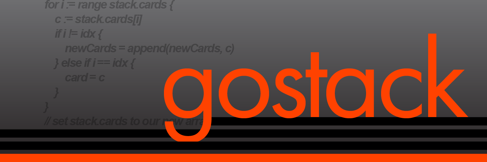

 `gostack` introduces **Stacks**, ambiguously-typed sets of elements intended to replace arrays and maps in *golang*.  **Stacks** are introduced alongside a variety of helpful functions to ensure programmer ease-of-use, concision, and flexibility.

 For the purposes of this project, we will use the imagery of a stack of cards.  A ***Stack*** will refer to a stack of cards; each element in that stack will be a ***Card***.  This is not to be confused with traditional stack structures (which only push and pop the first element in a stack).

 By default for generics, people tend to use *golang*'s list package, but this package is optimized only with the essentials for transforming and selecting list elements.  While `gostack` offers a much wider breadth of functions for transforming and selecting elements, it also allows you to turn **Stacks** into maps, quickly convert between arrays and **Stacks**, and—most excitingly—to use functions based on lambda expression including **sort**, **TrueForAll**, and **RemoveAll**.

 Many of the functions in this project were inspired by functions from *JavaScript* Arrays or *C#* Lists.

<h1>Overview</h1>

<h2>Files</h2>

 An overview of the files in this repository

 * **README.md** is this file
 * **TODO.txt** is a file with features to be added (significant only to `gostack` developers)
 * **caseTests.go** is a script used to run test cases to ensure functionality of this project's functions; for examples on how to use `gostack` functions, see this file; it is recommended to delete this file if it is not commented out at the time of your installation since it uses the main() function; in order to run test cases with ***test.go*** *not* commented out, run `go run .` in the top directory
 * **functions.go** is where novel functions are stored
 * **go.mod** is used to manage directory access
 * **structs.go** is where structs are defined

<h2>Links</h2>

 Where API links which inspired this project are stored

 * https://docs.microsoft.com/en-us/dotnet/api/system.collections.generic.list-1?view=net-6.0
 * https://developer.mozilla.org/en-US/docs/Web/JavaScript/Reference/Global_Objects/Array
 * http://web.cse.ohio-state.edu/software/common/doc/components/standard/Standard.html

<h2>Brief Documentation</h2>
 
<h3>Non-Generalized Functions</h3>

 * **MakeStack()**
 * **stack.Empty()**

<h3>Generalized Functions</h3>

 * **stack.Add(newCard, ORDER_*, POSITION_*, ...POSITIONDATA)**
 * **stack.Replace(newCard, RETURN_*, POSITION_*, ...POSITIONDATA)**
 * **stack.Extract(RETURN_*, POSITION_*, ...POSITIONDATA)**
 * **stack.Get(RETURN_*, POSITION_*, ...POSITIONDATA)**
 * **stack.Has(RETURN_*, POSITION_*, ...POSITIONDATA)**

<h3>Example Implementations</h3>
 
 <h4>Examples of how to get Card(s)</h4>

 > `stack.Get(RETURN_Card, POSITION_First)`
 >> *returns the first card in the Stack*
 >
 > `stack.Get(RETURN_Card, POSITION_Val, "String Value")`
 >>*goes through the stack, finds the first card with val "String Value", and returns that card*
 >
 > `stack.Get(RETURN_Cards, POSITION_Val, "String Value")`
 >>*goes through the stack, finds each card with val "String Value", and returns a Stack of each of those cards*
 >
 > `stack.Get(RETURN_Card, POSITION_Val, stackOfValues)`
 >> *goes through the stack, finds the first card with one of the values in stackOfValues, and returns that card*
 >
 > `stack.Get(RETURN_Cards, POSITION_Val, stackOfValues)`
 >> *goes through the stack, finds each card with one of the values in stackOfValues, and returns a Stack of each of those cards*

 <h4>stack.Push() Function Equivalent</h4>

 > `stack.Add(newCard, ORDER_BEFORE, POSITION_First)`
 >> *adds a card to the beginning of the stack*

 <h4>stack.Pop() Function Equivalent</h4>

 > `stack.Extract(RETURN_Card, POSITION_First)`
 >> *removes and returns the first card in the stack*

 <h4>stack.IndexOf(card) Function Equivalent</h4>
 
 > `stack.Get(RETURN_Idx, POSITION_Card, card)`
 >> *returns the index of the first found matching card*

<h3>Data Structures</h3>

 > ***name*** means it is conventionally acceptable to access this value manually
 >
 > **name** means it is highly recommended against accessing  value manually; you should instead use our functions

<h4>Structs</h4>

 Stack:
 > ***stack*** *Stack*
 >> **cards** *[]\*Card*
 >
 >> ***size*** *int*

 Card:
 > **card** *Card*
 >> **key** *any type*
 >
 >> **val** *any type*
 
 Slice:
 > ***Slice***
 >> ***startIdx*** *int*
 >
 >> ***endIdx*** *int*

<h4>Enums</h4>

 POSITION:
 > ***POSITION*** *[enum]*
 >> POSITION_First
 >>> *NONE*
 >>
 >> POSITION_Last
 >>> *NONE*
 >>
 >> POSITION_Idx
 >>> int
 >>
 >> POSITION_Val
 >>> any type
 >>
 >> POSITION_Key
 >>> any type
 >>
 >> POSITION_Card
 >>> Card
 >>
 >> POSITION_Slice
 >>> Slice
 >>
 >> POSITION_All
 >>> *NONE*

 RETURN:
 > ***RETURN*** *[enum]*
 >> RETURN_None
 >>> *NONE*
 >>
 >> RETURN_Idx
 >>> int
 >>
 >> RETURN_Idxs
 >>> Stack of ints
 >>
 >> RETURN_Key
 >>> any type
 >>
 >> RETURN_Keys
 >>> Stack of any type
 >>
 >> RETURN_Val
 >>> any type
 >>
 >> RETURN_Vals
 >>> Stack of any type
 >>
 >> RETURN_Card
 >>> Card
 >>
 >> RETURN_Cards
 >>> Stack of Cards

<h1>Exhaustive Documentation</h1>

<h2>Data Structures</h2>

 It is highly advised against using these data structures for reasons other than those listed in the *Recommended Uses* sections.  The entire purpose of this project is for you not to have to manage arrays manually, but documentation for objects intended to be hidden still exists for those who would like to add their own Stack functions

<h3>Stack</h3>

 This is the main struct in the project.

 > `stack` *Stack{}*
 >> `cards` *[]\*Card{}*
 >>> Returns an interface array to represent the elements in the Stack
 >> `size` *int*
 >>> Returns the cardinality (i.e., `len(stack.cards)`) of this Stack

 <h4>Recommended Uses</h4>

 * `stack.size`

<h3>Card</h3>

 This is a struct for our elements/maps within stacks.

 >> `card` *Card{}*
 >>> `card.key` *any type (interface{})*
 >>>> A key for this card-map (or nil if doesn't exist)
 >>>
 >>> `card.val` *any type (interface{})*
 >>>> The val of this card (or nil if doesn't exist)

 <h4>Recommended Uses</h4>
 
 * *None*

<h3>Slice</h3>

 This is a struct that makes it easier to pass two int values between functions on the backend.

 > `slice` *Slice{}*
 >> `slice.startIdx`
 >>> The first index in the desired slice
 >>
 >> `slice.endIdx`
 >>> The last index of the desired slice

 <h4>Recommended Uses</h4>
 
 * `something = slice.startIdx` *int*
 * `something = slice.endIdx` *int*

<h3>POSITION</h3>

 This is an enum intended to make it easy to flexibly inform functions what the intended target is.

 All functions that implement POSITION_* support all position types.  Their specific functions relative to each position are notated in the function API.

 > ***POSITION*** *[enum]*
 >> *POSITION_\* Sample*
 >>> *The type of the variable (called `data`) that needs to be passed into the function utilizing this constant*
 >>
 >>> *For instance, if you input `POSITION_Slice`, you would need to pass a **Slice** struct to your `data` parameter*
 >>
 >> POSITION_First
 >>> *NONE*
 >>
 >> POSITION_Last
 >>> *NONE*
 >>
 >> POSITION_Idx
 >>> interface{} *int or Stack of ints*
 >>
 >> POSITION_Val
 >>> interface{} *val or Stack of vals*
 >>
 >> POSITION_Key
 >>> interface{} *key or Stack of keys*
 >>
 >> POSITION_Card
 >>> Card *or* []Card
 >>
 >> POSITION_Slice
 >>> interface{} slice or Stack of slices*
 >>
 >> POSITION_All
 >>> *NONE*

 <h4>Recommended Uses</h4>
 
 * *See Generalized Function documentation*

<h2>Stack Functions</h2>

 Searching with browser utilities (e.g., `ctrl+f`) may be useful in this section.
 
<h3>_NotationSample</h3>
 
 > `variable1.function(variable2, THING_*, ...optional)`
 >> CONSTRUCTOR: ***TRUE***
 >>>> means the function requires no receiver (i.e., our sample `variable1` should not exist in this function call)
 >>
 >>> **variable1** is the variable we're constructing
 >>
 >> CONSTRUCTOR: ***FALSE***
 >>>> means the function's receiver is an existing stack (i.e., our sample `variable1` must exist in this function call)
 >
 >> GETTER: ***TRUE***
 >>>> means the function returns a value
 >>
 >>> **variable1** is the variable we're getting
 >
 >> SETTER: ***TRUE***
 >>>> means the function updates the inputted stack
 >>
 >>> **variable1** is a variable we're setting
 >>> **variable2** is a variable we're setting
 
 > ***Parameters***
 >> **variable1** *type* is the receiver for the function
 >
 >> **variable2** *type* is the first argument for the function
 >
 >> **THING_\*** *type* refers to how this input argument can be any variable starting with `THING_` that the function specifies is allowed
 >
 >> **...optional** *type* refers to how this input argument does not have to be inputted in the function (refer to documentation to decide whether to input)
 >>> A sample instance where you would not input an argument in this spot is when you're using POSITION_First, which does not intake any data.  That said, take care not to input more than 1 argument to optional parameters; everything will compile if you do, but this action is not supported by `gostack`.
 
 > ***Pseudocode***
 >> This section outlines what the function does in simplistic terms
 >
 >> When pseudocode says a Stack's cards are updated, it is implied that stack.size is updated correspondingly

<h3>MakeStack</h3>

 > `MakeStack()`
 >> CONSTRUCTOR: ***TRUE***
 >>> Stack
 >
 >> GETTER: ***TRUE***
 >
 >> SETTER: ***FALSE***
 
 > ***Pseudocode***
 >> return a new Stack
 
<h3>Empty</h3>
 
 > `stack.Empty()`
 >> CONSTRUCTOR: ***FALSE***
 >
 >> GETTER: ***TRUE***
 >>> **stack**
 >
 >> SETTER: ***TRUE***
 >>> **stack**
 
 > ***Parameters***
 >> **stack** is the Stack to be emptied
 
 > ***Pseudocode***
 >> remove all cards in the stack
 >
 >> return the empty stack
 
<h3>Add</h3>
 
 > `stack.Add(toAdd, beforeNotAfter, POSITION_*, ...data)`
 >> CONSTRUCTOR: ***FALSE***
 >
 >> GETTER: ***TRUE***
 >>> **stack**
 >
 >> SETTER: ***TRUE***
 >>> **stack**
 
 > ***Parameters***
 >> **stack** *Stack*
 >
 >> **toAdd** *Card* or *Stack* is either a Card or a Stack of cards to insert at POSITION
 >
 >> **beforeNotAfter** *bool* is used to control whether **card** is added before or after the position
 >
 >> **POSITION_\*** *POSITION* is used to provide the function relevant POSITION data to find the correct position
 >
 >> **...data** *any type (interface{})* is used to provide the function relevant additional data to find the correct position

 > ***Pseudocode***
 >> **IF VALID POSITION**
 >>> **IF beforeNotAfter**
 >>>> add card before POSITION in the stack
 >>>
 >>> **ELSE**
 >>>> add card after POSITION in the stack
 >>>
 >>> **FOR EACH CARD THAT ALREADY EXISTED IN THE STACK**
 >>>> that card's previous index i is updated to i + 1
 >>>
 >>> return updated stack
 >>
 >> **ELSE**
 >>> return nil
 
<h3>Replace</h3>
 
 > `stack.Replace(toInsert, POSITION_*, ...data)`
 >> CONSTRUCTOR: ***FALSE***
 >
 >> GETTER: ***TRUE***
 >>> card that was replaced *or* nil
 >
 >> SETTER: ***TRUE***
 >>> **stack**
 
 > ***Parameters***
 >> **stack** *Stack* is the Stack from which to remove the first card
 >
 >> **toInsert** *Card* or *Stack* is either a Card or a Stack of cards to insert at POSITION(S) as the replacement
 >
 >> **POSITION_\*** *POSITION* is used to provide the function relevant POSITION data to find the correct card to replace
 >
 >> **...data** *any type (interface{})* is used to provide the function relevant additional data to find the correct card to replace

 > ***Pseudocode***
 >> **IF STACK IS NOT EMPTY**
 >>> replace cards from the stack with toInsert based on provided POSITION data
 >>
 >>> return the removed card(s) in a new stack
 >
 >> **ELSE**
 >>> return nil
 
<h3>Extract</h3>
 
 > `stack.Extract(POSITION_*, ...data)`
 >> CONSTRUCTOR: ***FALSE***
 >
 >> GETTER: ***TRUE***
 >>> extracted card *or* nil
 >
 >> SETTER: ***TRUE***
 >>> **stack**
 
 > ***Parameters***
 >> **stack** *Stack* is the Stack from which to remove the first card
 >
 >> **POSITION_\*** *POSITION* is used to provide the function relevant POSITION data to find the correct card to extract
 >
 >> **...data** *any type (interface{})* is used to provide the function relevant additional data to find the correct card to extract

 > ***Pseudocode***
 >> **IF STACK IS NOT EMPTY**
 >>> remove cards from the stack based on provided POSITION data
 >>
 >>> return the removed card(s)
 >
 >> **ELSE**
 >>> return nil
 
<h3>Get</h3>
 
 > `stack.Get(POSITION_*, ...POSITIONDATA, ...RETURNDATA)`
 >> CONSTRUCTOR: ***FALSE***
 >
 >> GETTER: ***TRUE***
 >>> card that was replaced *or* nil
 >
 >> SETTER: ***FALSE***
 
 > ***Parameters***
 >> **stack** *Stack* is the Stack from which to remove the first card
 >
 >> **POSITIONDATA\*** *POSITION* is used to provide the function relevant POSITION data to find the correct card to replace
 >
 >> **...data** *any type (interface{})* is used to provide the function relevant additional data to find the correct card to replace

 > ***Pseudocode***
 >> **IF STACK IS NOT EMPTY AND HAS TARGETED DATA**
 >>> return data
 >
 >> **ELSE**
 >>> return nil
 
<h3>Has</h3>
 
 > `stack.Has(lookFor, POSITION_*, ...data)`
 >> CONSTRUCTOR: ***FALSE***
 >
 >> GETTER: ***TRUE***
 >>> bool
 >
 >> SETTER: ***FALSE***
 
 > ***Parameters***
 >> **stack** *Stack* is the Stack to search for **lookFor**
 >
 >> **lookFor** *Card* or *Stack* is either a Card or a Stack of cards to find in **stack**
 >
 >> **POSITION_\*** *POSITION* is used to provide the function relevant POSITION data to find the correct cards to search
 >
 >> **...data** *any type (interface{})* is used to provide the function relevant additional data to find the correct cards to search
 
 > ***Pseudocode***
 >> **IF STACK IS NOT EMPTY AND HAS TARGETED DATA**
 >>> return true
 >
 >> **ELSE**
 >>> return false
 
<h1>Unimplemented Features</h1>

 <h2>Generalized Functions</h2>

 * Add **Sort** function
 * Add **TrueForAll** function

 <h2>Non-Generalized Functions</h2>

 * Add **CombineWith** function
 * Add **Flip** function
 * Add **Shuffle** function
 * Add **Clone** function
 * Add **ToArray** function
 * Add **ToStack** function

<h1>Footer</h1>

This project was created by Gabe Tucker.

If there are any changes or comments you would like to have made in respect to this project, please email `tucker.854@osu.edu`.  I appreciate any feedback and will usually respond within 1-2 business days.

Feel free to visit my personal pages at `https://gabetucker.com` or `https://www.linkedin.com/in/gabetucker2/`.
