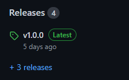
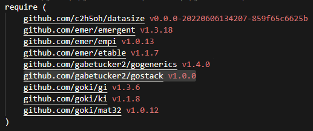
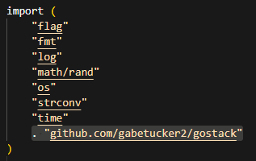

 <h1>Installation</h1>

 1. Edit your **go.mod** file
   
    *([or add one if you haven't already](https://go.dev/doc/tutorial/create-module))*
 2. Add `github.com/gabetucker2/gostack [release version]` to **go.mod**'s **require** clause

 
 

 3. Type `go mod tidy` in your terminal
 
    *(ensuring that **go.mod** is a direct child of your current directory)*

 4. Add `. "github.com/gabetucker2/gostack"` to the **imports** of every file in which you would like to use ***gostack***

 

 *If you have any trouble, please reach out to us on our [official Discord community](https://discord.gg/NmxxcKBVBU).*

---
 [> Return to glossary](../README.md)