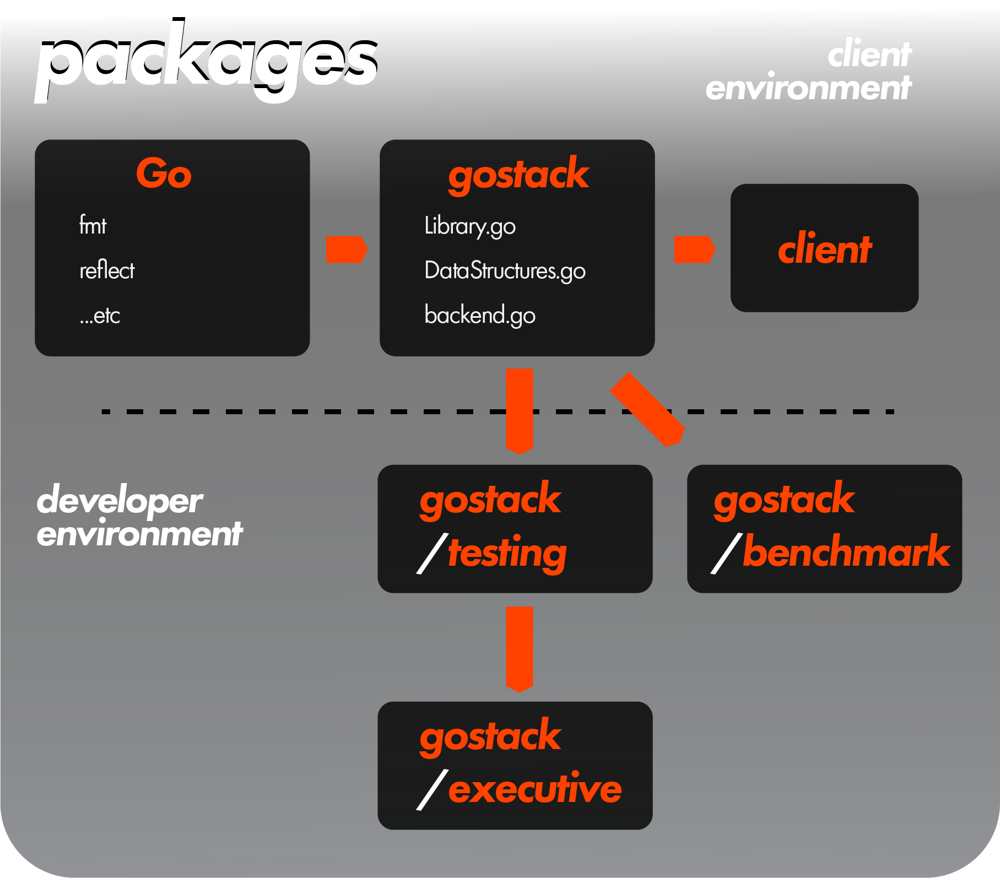
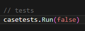
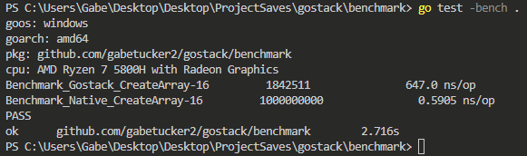

<h1>Meta Documentation</h1>

 

 <h2>SampleFunction Documentation</h2>

 `(receiver receiverType) SampleFunction(parameter1 parameter1Type, parameter2 parameter2Type, optionalParameter3 optionalParameter3Type [defaultValueIfNilOrNoInput3], optionalParameter4 optionalParameter4TypeA|optionalParameter4TypeB [defaultValueIfNilOrNoInput4]) (return1 returnType1, return2 returnType2)`

 *Ending `SampleFunction` after passing two arguments will default `optionalParameter3` and `optionalParameter4` to [`defaultValueIfNilOrNoInput3`] or [`defaultValueIfNilOrNoInput4`], respectively.  You can do the same by ending `SampleFunction` after three arguments, in which case this would only happen with `optionalParameter4`.*

 *Below will use very rough pseudocode abstractions outlining the data structures that do not reflect the actual design of **gostack** structures.*

```
 A short description of what the function does

 @notes
 | [A set of notes about the function]
 @requires
 | [A set of requirements the client must fulfill for the inputs]
 @ensures
 | [A set of conditions outlining how the function will handle various parameter configurations given different input values]
 @examples
 | sampleInput1 => output1
 | sampleInput2 => output2
 | ... additional examples as needed
```

<h2>JDoc Documentation</h2>

 We roughly adhere to [design-by-contract principles](http://web.cse.ohio-state.edu/software/2221/web-sw1/extras/slides/09.Design-by-Contract.pdf) as established by The Ohio State University's CSE department in writing JDoc-style documentation for our functions.

<h2>Interchangeable Terminology</h2>

 Throughout this project: 
 * "interface" is used interchangeably with "any"
 * "nil" is used interchangeably with "not passing any argument into an optional parameter" 

<h2>How to run our cases/test code/benchmarks</h2>

Say you wanted to double-check that our case tests of the library are working properly, or perhaps you wanted to add your own case tests for debugging purposes.  Or, perhaps you would like to run our benchmarks on your computer.  In either a case:

 1. [Clone](https://github.com/git-guides/git-clone) this repository to your PC
 2. Open a terminal

<h3>Case Tests</h3>

 1. Enter the `executive` folder of your clone via your terminal
 2. Edit the `main()` function in `executive.go` to call your desired functions
 3. Type `go run .`
 4. See the output for each function call!

 If you'd like to configure this output, enter `executive.go`...

 

 * Passing `true` into `casetests.Run` gives a detailed terminal output, useful for debugging and finding which case test function is causing errors
 * Passing `false` into `casetests.Run` gives a concise terminal output, useful for quickly ensuring that everything is working properly

<h3>Benchmarks</h3>

 1. Enter the `benchmark` folder of your clone via your terminal
 2. Type `go test -bench .`
 3. See the output for each benchmark function test!

 

Look at the `ns/op` to compare speeds between ***gostack*** and ***native Go***.  This tells you the average time (in nanoseconds) each function call took.

 ---

 [> Return to glossary](../README.md)