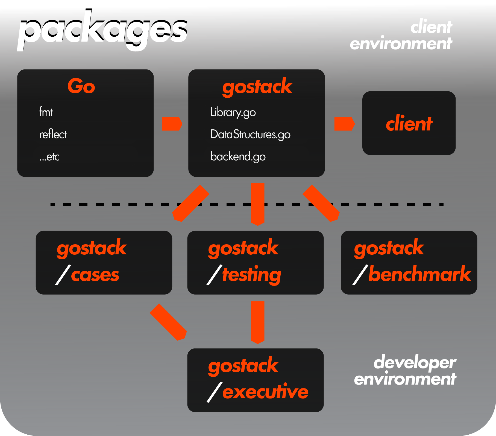

<h1>Meta Documentation</h1>

 

 <h2>SampleFunction Documentation</h2>

 `(receiver receiverType) SampleFunction(parameter1 parameter1Type, parameter2 parameter2Type, optionalParameter3 optionalParameter3Type [defaultValueIfNilOrNoInput3], optionalParameter4 optionalParameter4TypeA|optionalParameter4TypeB [defaultValueIfNilOrNoInput4]) (return1 returnType1, return2 returnType2)`

 *Ending `SampleFunction` after passing two arguments will default `optionalParameter3` and `optionalParameter4` to [`defaultValueIfNilOrNoInput3`] or [`defaultValueIfNilOrNoInput4`], respectively.  You can do the same by ending `SampleFunction` after three arguments, in which case this would only happen with `optionalParameter4`.*

 *Below will use very rough pseudocode abstractions outlining the data structures that do not reflect the actual design of **gostack** structures.*

```
 A short description of what the function does

 @notes
 | [A set of notes about the function]
 @requires
 | [A set of requirements the client must fulfill for the inputs]
 @ensures
 | [A set of conditions outlining how the function will handle various parameter configurations given different input values]
 @examples
 | sampleInput1 => output1
 | sampleInput2 => output2
 | ... additional examples as needed
```

<h2>JDoc Documentation</h2>

 We roughly adhere to [design-by-contract principles](http://web.cse.ohio-state.edu/software/2221/web-sw1/extras/slides/09.Design-by-Contract.pdf) as established by The Ohio State University's CSE department in writing JDoc-style documentation for our functions.

<h2>Interchangeable Terminology</h2>

 Throughout this project: 
 * "interface" is used interchangeably with "any"
 * "nil" is used interchangeably with "not passing any argument into an optional parameter"

 ---

 [> Return to glossary](../README.md)