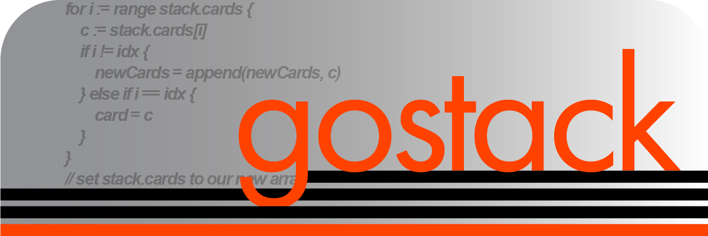
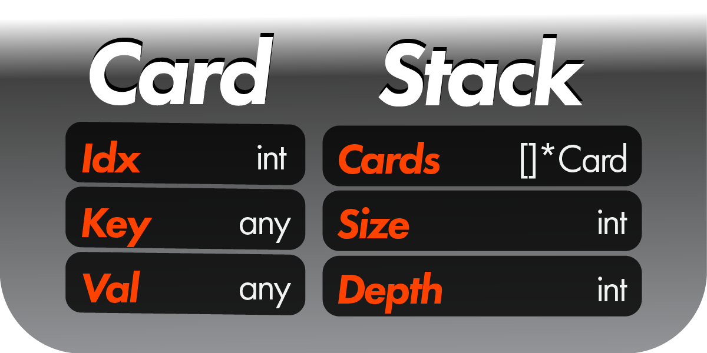
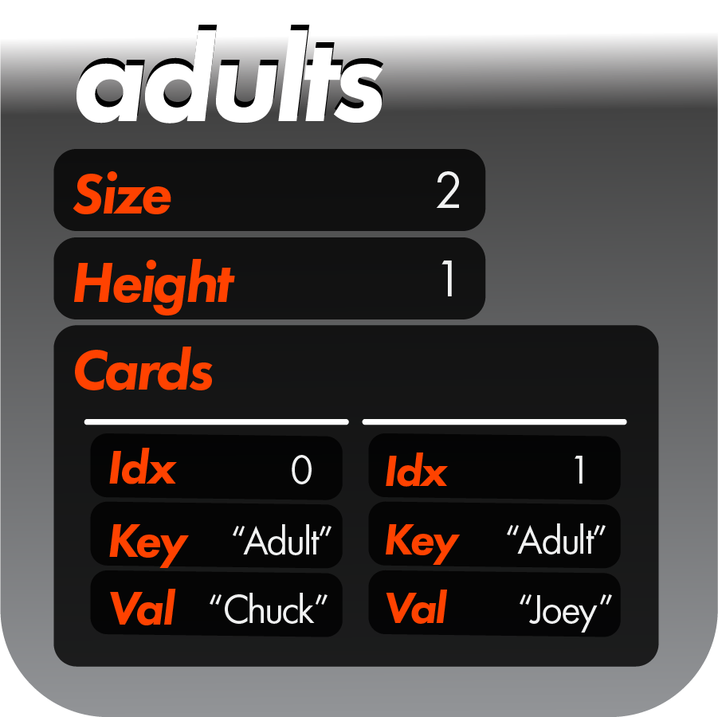
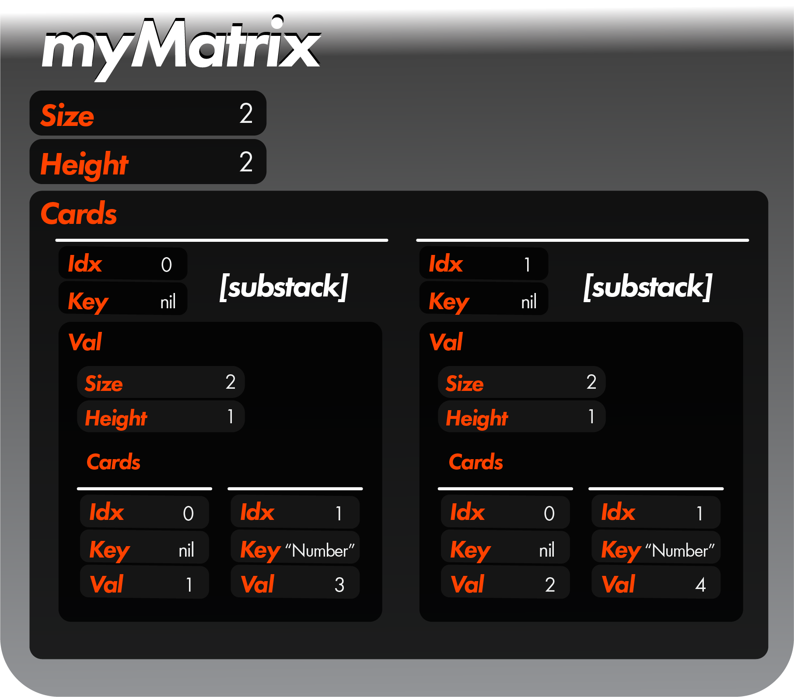
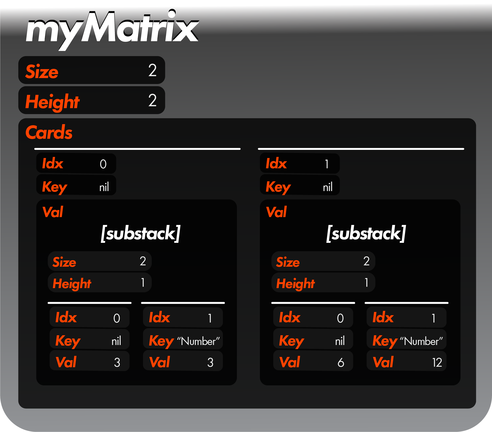

 <h1>Overview</h1>

 Let's get a sense of what ***gostack*** looks like.  We'll start with the structs it introduces:
 
 

 Without yet using these structs, let's make a map structure in ***native Go***:

 ```
 existingMap := map[string]string {"Tommy":"Kid", "Chuck":"Adult", "Joey":"Adult"}
 ``` 
 Now that we have our map structure, let's make it into a **Stack** so that we can use it with ***gostack*** functions:

 ```
 kidsAndAdults := MakeStack(existingMap)
 ```

 

 Great!  Next, we will get all the people in `kidsAndAdults` who are adults:

 ```
 adults := kidsAndAdults.GetMany(FIND_Val, "Adult")
 ```

 

 Pretty straight-forward!  But what if we want to make something more complicated, like a matrix?  Let's do that here, fitting an array with four elements to a 2x2 matrix:

 ```
 myMatrix := MakeStackMatrix([]int {1, 3, 2, 4}, nil, []int {2, 2})
 ```
 
 

 In a matrix structure, "substack" will refer to cards whose val is another stack, and "card" will refer to cards whose val is not another stack.

 The complexity of this tree structure may feel a lot more difficult to navigate than a traditional `[][]array` structure.  But worry not!  You won't have to navigate through this.  You can treat this as a data structure which looks like `{{1, 3}, {2, 4}}`.

 For instance, to set the key of every final card in a substack of `myMatrix` to "Number", we would simply do:

 ```
 myMatrix.UpdateMany(REPLACE_Key, "Number", FIND_Last)
 ```

 

 Finally, let's say we wanted to do something a little more complex, like multiplying every multiple of 8 by 3:

 ```
 myMatrix.UpdateMany(REPLACE_Lambda, func(card *Card) {
  card.Val = card.Val.(int) * 3
 }, FIND_Lambda, func(card *Card) (bool) {
  return card.Val.(int) % 8 == 0
 })
 ```

 

These examples should give you an intuitive feel of how ***gostack*** works!

---

 [> Frequently asked questions (Recommended)](faq.md)
 
 [> Introductory tutorial (Recommended)](tutorials/introductionTutorial.md)

 [> How many lines does gostack save compared to native Go?](race.md)

 [> How fast is gostack compared to native Go?](benchmark.md)

 [> Return to glossary](../README.md)