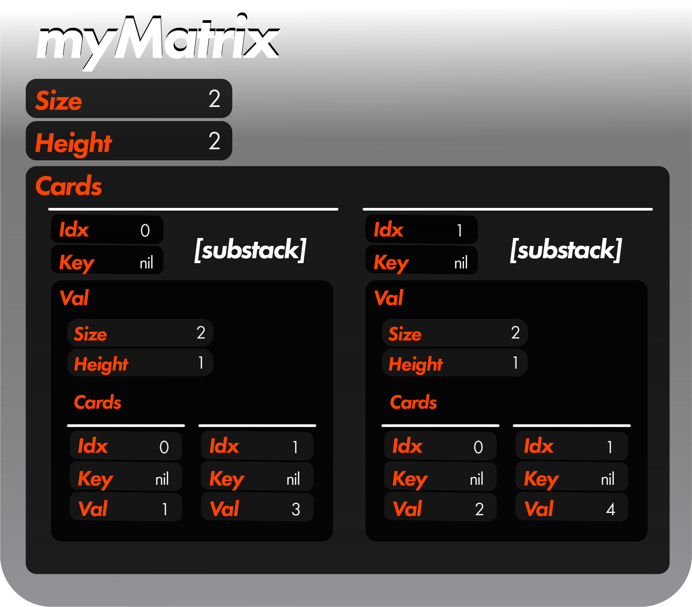

<h1>Structs Documentation</h1>

<h2>Introduction</h2>

 In ***gostack***, there are simply two structs:

 

 These are the only structs you have to understand in order to master ***gostack***!

<h2>Stack Matrix</h2>
 In a matrix structure, "substack" will refer to cards whose vals are other stacks, and "card" will refer to cards whose vals are not other stacks.  "Stack matrix" will refer to any *Stack object which holds substacks.  For instance, given some stack matrix named "myMatrix":

 
 
 The cards whose vals are 1, 3, 2, and 4, respectively (the grandchildren of myMatrix), are called "cards" in this context.  Conversely, the cards whose vals are other stacks (the children of myMatrix) are called "substacks", even though their data type is `*Card`.

<h2>Key Stacks</h2>

 If you would like to set the key of a card to something complex like another stack, feel free to do so, as our functions will fully support this.  However, there is no built-in support for performing searches within a stack pointed to by a key.  You can do so with your own lambda functions, but it is recommended just to put your substacks in the val slot instead since that is for what vals are intended.

<h2>The Golden Rule</h2>

 Never (*ever*) enter the same **Card** object into more than one **Stack**.  Doing so will break your cards/stacks.  If you would like to add a card to a new stack, you must either A) remove the card from the first stack, or B) make a clone of the card.

 Given the following:

 ```
 stack := MakeStack([]int {1, 2})
 card := stack.Get(FIND_First)
 ```

 ...this is a crime:

 ```
 newStack := MakeStack([]*Card {card})
 ```

 ...and these are morally permissable:

 ```
 stack.Remove(card)
 newStack := MakeStack([]*Card {card})
 ```

 ```
 newStack := MakeStack([]*Card {card.Clone()})
 ```

 It should be noted that functions which return a *Stack, like GetMany, automatically clone each card.

 ---

 [> Return to glossary](../README.md)