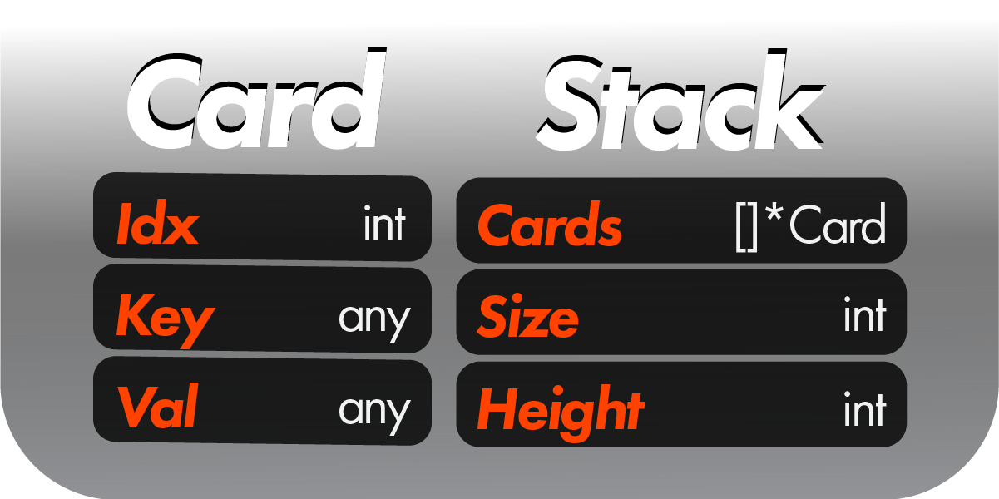
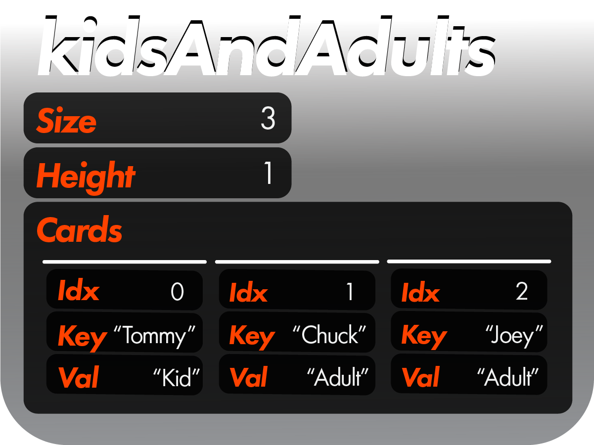

 <h1>Introductory Tutorial</h1>

 <h2>Structs</h2>

 Hi there.  Welcome to the ***gostack*** introductory tutorial!  This tutorial will familiarize you with the primary functions and concepts in gostack.  Let's quickly recap what Cards and Stacks are in ***gostack***:

 

 Stacks are data structures that hold a set of cards.  Cards hold data you'd like to retrieve, including possibly other stacks, thereby making stacks a recursive data structure.  With that in mind, let's begin with some intuitive examples of ***gostack*** code and break them down.

 <h2>Making a Stack</h2>
 
 First, we will make a stack using `myStack := MakeStack()`.  This stack, by default, looks like the following:

```		
myStack Stack {
    Size: 0,
    Height: 1,
    []*Cards: { },
}
```

 <h2>Making a Card</h2>

 Great!  We have now made an empty stack.  Now let's make some cards we can add to the stack:
 
```
cardA := MakeCard("Butterfly")
cardB := MakeCard("Praying Mantis")
cardC := MakeCard("Beetle")
```
 
cardA looks like the following:

```
cardA Card {
    Idx: -1,
    Key: nil,
    Val: "Butterfly"
}
```

<h2>Making a Stack of Cards</h2>
 
We have now created three cards.  But these cards are kind of awkwardly floating around in the void, so let's store them in myStack so we can use them.  There are several ways we could do this that are useful in different situations...

> If you have already created your cards but have not yet created your stack:
>
> `myStack = MakeStack([]*Card {cardA, cardB, cardC})`

> If you have neither created your cards nor your stack:
>
> `myStack = MakeStack([]string {"Butterfly", "Praying Mantis", "Beetle"})`
>
> `myStack = MakeStack([]*Card {MakeCard("Butterfly"), MakeCard("Praying Mantis"), MakeCard("Beetle")})`

> If you have already created your cards and your stack and you don't want to replace your existing stack:
>
> `myStack.Add(MakeStack([]*Card {cardA, cardB, cardC}))`
>
> `myStack.Add(cardA).Add(cardB).Add(cardC)`
>
> `myCards := []*Card {cardA, cardB, cardC}; myStack.Add(myCards);`

Each of these solutions yield the same result:

```
myStack Stack {
    Size: 3,
    Height: 1,
    []*Cards: {
        cardA Card {
            Idx: 0,
            Key: nil,
            Val: "Butterfly"
        },
        cardB Card {
            Idx: 1,
            Key: nil,
            Val: "Praying Mantis"
        },
        cardC Card {
            Idx: 2,
            Key: nil,
            Val: "Beetle"
        },
    },
}
```
For a more visual example:

```
 kidsAndAdults := MakeStack([]string {"Tommy", "Chuck", "Joey"},
                            []string {"Kid",   "Adult", "Adult"})
```

 


 <h2>Function Naming Conventions</h2>

Simple enough!  However, there is an important distinction to make before moving on: functions with name "N" will often have a corresponding function named "NMany".
 
 In such a case, N will only "perform" the function intent on the first found card, whereas NMany will "perform" the function intent on every found card.  For instance:

 ```
 stack.Get(FIND_First) // gets the first card in the set "first"
 stack.Get(FIND_All) // gets the first card in the set "all" (same as previous)
 stack.GetMany(FIND_All) // gets all cards in the set "all"
 stack.Extract(FIND_All) // extracts the first card in the set "all"
 stack.ExtractMany(FIND_All) // extracts all cards in the set "all"
 ```

<h2>Doing Stuff with our Stacks</h2>

With that in mind, let's say we were to make a book about insects.  This is a very strange book: it is just a list of insect names paired with the amount of years that have passed since their discovery.  This is a map structure: there can only be one of each insect name, but there can be many insects with a shared year of discovery.  As such, this is how we would make our data structure:

```
myStack = MakeStack([]string {"Butterfly", "Praying Mantis", "Beetle", "Ant", "Bumble Bee"}, []int {20, 539, 539, 340, 11})
```

Great!  So now, let's say we wanted to access this structure in various ways.  We would do this using the stack.[Get](../functions/stack_Get.md)/[GetMany](../functions/stack_GetMany.md)() functions.  For simplicity's sake, we will show only the keys of the card(s) returned.  Given `var gottenData any`:

> To get the first card in myStack:
>
> `gottenData = myStack.Get(FIND_First) // Butterfly`
>
> `gottenData = myStack.Get(FIND_First, nil) // Butterfly`
>
> `gottenData = myStack.Get(FIND_Idx, 0) // Butterfly`
>
> `gottenData = myStack.Get(FIND_All) // Butterfly`

> To get the first card with the val of 539:
>
> `gottenData = myStack.Get(FIND_Val, 539) // Praying Mantis`

> To get a stack containing all cards with the val of 539:
>
> `gottenData = myStack.GetMany(FIND_Val, 539) // Stack{Praying Mantis, Beetle}`

> To get all cards whose vals are either 20 or 340:
>
> `gottenData = myStack.GetMany(FIND_Val, []int {20, 340}) // Stack{Butterfly, Ant}`
>
> `gottenData = myStack.GetMany(FIND_Val, MakeStack([]int {20, 340})) // Stack{Butterfly, Ant}`

> To get all cards whose vals are under 30 (read more on this type of functionality in Lambda.go):
```
gottenData = myStack.GetMany(FIND_Lambda, func(card *Card) bool {
	return card.Val.(int) < 30
}) // Stack{Butterfly, Bumble Bee}
```

<h2>Additional Function Examples</h2>

Exciting!  So we have now have retrieved data from our myStack stack in various different ways.  But, in each output, we have gotten either a Card (from .Get()) or a stack of cards (from .GetMany()).  But what if we wanted to make a new stack whose values are the keys of myStack?  I.E., if you wanted to play around with the types of insects without messing up myStack, what would you do?

`gottenData = myStack.GetMany(FIND_All, nil, RETURN_Keys)`

There we go!  We now have a stack whose cards' keys are nil and whose cards vals are myStack's keys.  You can do the equivalent of this for [Idxs, Vals, or other data](../enums/RETURN.md).
	
But what if we wanted to do something more complex, like removing cards that were found in the stack, or replacing them with another value?

> Remove found cards for gottenData from a clone of myStack:
>
> `gottenData = myStack.Clone().ExtractMany(FIND_Val, 539) // Stack{Praying Mantis, Beetle}`

> Set gottenData to myStack where myStack's first card is placed after its last card:
>
> `gottenData = myStack.Move(FIND_First, ORDER_After, FIND_Last)`

> Set gottenData to a clone of myStack which has another card appended to the end of its stack:
>
> `gottenData = myStack.Clone().Add(MakeCard("Moth", 400), ORDER_After, FIND_Last)`

> Replace first card in myStack with a moth card, setting gottenData to the card that was replaced:
>
> `gottenData = myStack.Replace(REPLACE_Card, MakeCard("Moth", 400), FIND_First)`

> Set gottenData to a clone of myStack where the first card and the second card are switched:
>
> `gottenData = myStack.Clone().Swap(FIND_First, FIND_Idx, nil, 1)`

> Set gotten data to a clone of myStack which is put into a random order, Flipped in the opposite order, and with any cards who have the same value as other cards removed:
>
> `gottenData = myStack.Clone().Shuffle().Flip().Unique()`

<h2>Overriding</h2>

In many cases, you will want to add a card whose val is a stack to a stack.  However, ***gostack***, by default, is configured to read such cases as adding several cards in a stack to a stack.  The same holds true of other functions like the get functions, where you will want to get a substack rather than the set of cards in that substack:

```
mySubstack := MakeSubstack([]int {3, 6})
validCard := MakeStack([]*Stack {mySubstack, MakeStack([]int {9, 12})}).Get(FIND_Val, mySubstack, nil, nil, nil, nil, OVERRIDE_True) // returns the card whose val is mySubstack
validCard := MakeStack([]*Stack {mySubstack, MakeStack([]int {9, 12})}).Get(FIND_Val, mySubstack, nil, nil, nil, nil, OVERRIDE_False) // nil, since neither 3 nor 6 are in the stack
```

In the above examples, we can set `overrideFindData` to `OVERRIDE_True` so that we can search for a specific substack in a stack, or we can keep it `OVERRIDE_False` so that we can test whether any card vals in mySubstack match the vals of the cards through which we are iterating.

```
myWeirdStack := MakeStack([]any {1, 2}).Add(MakeStack([]int {0}), ORDER_After, FIND_Last, nil, nil, nil, nil, nil, OVERRIDE_True) // []any {1, 2, Stack{0}}
myWeirdStack := MakeStack([]any {1, 2}).Add(MakeStack([]int {0}), ORDER_After, FIND_Last, nil, nil, nil, nil, nil, OVERRIDE_False) // []any {1, 2, 0}
```

We can do the same when configuring `overrideInsert`.

<h2>Conclusion</h2>

There are many more functions than the ones displayed here that you are welcome to [read about](../functionsAPI.md), but, for now, the these examples should suffice for providing intuitions about how gostack generally works.

---
 [> Go to StackMatrix tutorial (Recommended)](matricesTutorial.md)

 [> Return to glossary](../../README.md)