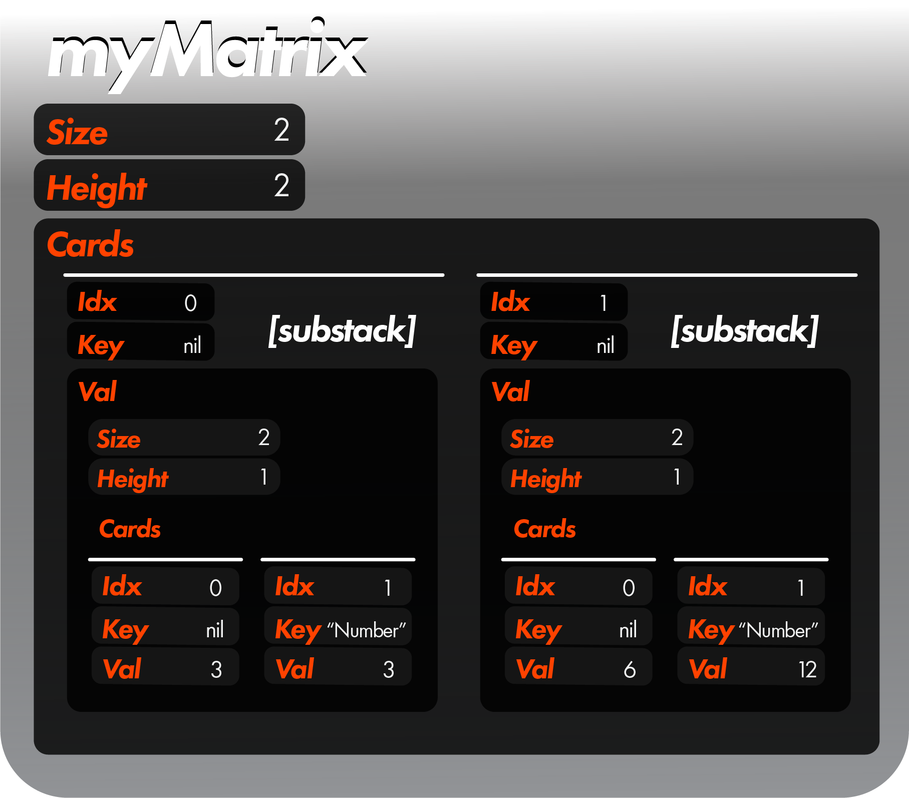

 <h1>Lambda Tutorial</h1>

 <h2>Overview</h2>

 Hi there.  Welcome to the Lambda tutorial!  This is the most exciting tutorial in ***gostack*** because of the flexibility that Lambda functions provide.  Don't like one of our functions?  Make your own lambda function to update it to your liking.  Feel like we're missing something, or need a very specific task completed?  Make your own lambda function!  In fact, most major functions in ***gostack*** were written using ***gostack*** lambda functionality.

 Let's return to our example from the overview where we multiply every multiple of 8 by 3:

  

 ```
 myMatrix.UpdateMany(REPLACE_Lambda, func(card *Card) {
  card.Val = card.Val.(int) * 3
 }, FIND_Lambda, func(card *Card) (bool) {
  return card.Val.(int) % 8 == 0
 })
 ```

 

 So what exactly is going on here?  We are creating two lambda functions: one via our  `replaceData` parameter, and one via our `findData` parameter.  Let's cover what these mean.

<h2>FIND_Lambda</h2>

 Provided that we input `FIND_Lambda` to our `findType` parameter, we are expected to input a function to `findData` that returns a boolean value and adheres to the [proper documentation](../enums/FIND.md).  We can do so like so:

```
func getMultiplesOf8 (card *Card) (bool) {
    return card.Val.(int) % 8 == 0
}
MakeStack([]int {2, 8, 16}).GetMany(FIND_Lambda, getMultiplesOf8) // returns all cards in the stack who are multiples of 8
```

Alternatively, if we are only going to call this function once, we can simplify it to be all in one line:

```
MakeStack([]int {2, 8, 16}).GetMany(FIND_Lambda, func (card *Card) (bool) {
    return card.Val.(int) % 8 == 0
}) // returns all cards in the stack who are multiples of 8
```

<h2>REPLACE_Lambda</h2>

Just like for `FIND_Lambda`, we input a function for `replaceData` that adheres to [the documentation](../enums/REPLACE.md), meaning there is no return value.  We can do this like so:

```
MakeStack([]int {1, 2, 3}).UpdateMany(REPLACE_Lambda, func (card *Card) {
    card.Val = card.Val.(int) * 3
}, FIND_All) // {3, 6, 9}
```

<h2>Standalone Lambda Functions</h2>

But these functions are limiting in that they can only be called in certain contexts.  What if we just want to call a function without any contingencies?

```
MakeStack([]int {1, 2, 3, 4}, nil, []int {2, 2}).Lambda(func (card *Card) {
    // do stuff here with each card
})
```

`stack.Lambda` returns (stack, retStack, retCard, retVarPtr) such that ret variables are variables which can be updated as the function runs from within the lambda function.  For instance, if you had a lambda function which returns every other card in `stack`, you would add every other card to `retStack` and access the return value for `retStack`.

However, it can be frustrating having so many return types, as this forces you to gather your return data on an individual line.  So if you would like to JUST return retStack, you can call `stack.LambdaStack`, which is identical to `stack.Lambda`.  If you would like to JUST return `stack`, then you can do `stack.LambdaThis`.  That way, you can do `myStack.LambdaThis(...).Get(...).Add(...) ...` without having to break up the line!  [See the rest of the Lambda function variations here.](../functions/stack_Lambda.md)

<h2>retStack, retCard, and retVarPtr</h2>

Let's look at how we would manage various return types using our Lambda function:

```
thisStack, retStack, retCard, retVarPtr := MakeStack([]string {"Save retCard", "Make new substack", "Save retVarPtr"}, []any {1, 2, 3}).Lambda(func (card *Card, _ *Stack, _ bool, _ *Stack, retStack *Stack, retCard *Card, retVarPtr any) {

    switch card.Key {
    case "Make new substack":
        *retStack = *MakeSubstack([]*Card {card.Clone()}).Duplicate(5)
    case "Save retCard":
        *retCard = *card
    case "Save retVarPtr":
        *(retVarPtr.(*any)) = card.Val
    }

})
// Stack{"Save retCard" ... etc}, Stack{2, 2, 2, 2, 2}, card{1}, *any => 3
```

Great!  If we wanted, for instance, just to return retStack, we would replace `.Lambda()` with `.LambdaStack()`.

Note that retVarPtr is an interface pointer (`*any`).  This means that it *must* be converted into type *any and then dereferenced before being used—otherwise it cannot store your data.

If we wanted to initialize our ret values to certain starting values, we would do the following:

```
this, stack, card, varAdr := MakeStack([]string {"Hey"}).Lambda(func() {}, MakeStack([]int {66}), MakeCard("Howdy"), 520)
// Stack{"Hey"}, Stack{66}, card{"Howdy"}, 520
```

Notice that even though our lambda function is empty, the values returned as they were initialized.

<h2>Additional Parameters</h2>

Lambda functions also have a `workingMem` slot, which practically equivalent to an array of varAdrs that does not return anywhere.  For instance, if you had a Lambda function that calculates the maximum card in your set and then does stuff based on that, it would be inefficient to recalculate the maximum value each iteration, so you should instead reference a `workingMem` value.

`parentStack` tells you information pertaining to the immediate parent stack of this card, e.g., if you wanted to grab the size of the stack the current card is in.

The `isSubstack` parameter simply tells you whether the card you are currently on is a substack or a card with a non-substack value.

The `coords` parameter tells you the location of this card from the root stack by storing each index in a card respectively.  For instance, in {{A, B}, {C, D}}, C would have the coordinates Stack{0, 1}.

Finally, lambda functions have an `otherInfo` slot.  To explain what this is for, let's consider an instance where you would like to return the found card object rather than a copy of the found card object.  In such a case, doing `*retCard = *card` would merely return a clone of card ([see explanation here](https://stackoverflow.com/a/74090525/19591217)).  As a result, let's look at `otherInfo` data: `[]any {cardPtr, parentStackPtr, retStackPtr, retCardPtr}`.  Given this data, instead of merely dereferencing `retCard`, let's instead convert `retCardPtr` to a Card pointer pointer and dereference that pointer pointer, setting it to cardPtr, thereby allowing us to redirect the pointer to a specific object:

```
*otherInfo[3].(**Card) = *otherInfo[0].(**Card)
```

---
 [> Go to Pointers tutorial (Recommended)](pointersTutorial.md)

 [> Return to glossary](../README.md)