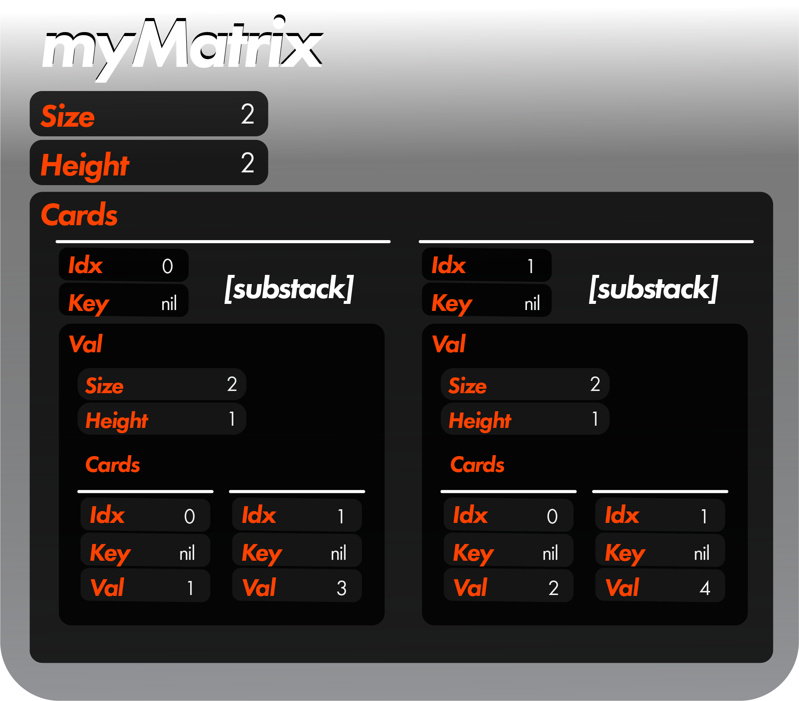

 <h1>StackMatrix Tutorial</h1>

 <h2>Overview</h2>

 Hi there.  Welcome to the StackMatrix tutorial!  Let us quickly review how stackMatrices are structured for this tutorial's purposes.

 ```
 myMatrix := MakeStackMatrix([]int {1, 3, 2, 4}, nil, []int {2, 2})
 ```

 This creates a 2x2 stack matrix from our 1D array:
 
 </img>

 In a matrix structure, "substack" will refer to cards whose val is another stack, and "card" will refer to cards whose val is not another stack.  But you can just treat this as a data structure which looks like `{{1, 3}, {2, 4}}`.

 For instance, to set the key of every final card in a substack of `myMatrix` to "Number", we would do:

 ```
 myMatrix.UpdateMany(REPLACE_Key, "Number", FIND_Last, nil, DEEPSEARCH_True, nil, PASS_Cards)
 ```

 

 Now let's expand on what exactly this means.

 <h2>DEEPSEARCH and Depth</h2>

 Given the above 2D matrix, there are two layers: the "substack" layer, and the "card" layer.  Say we wanted to search only the "substack" layer.  In such a case, we would use `DEEPSEARCH_False`, meaning it only looks at the first layer down from myMatrix:

```
 myMatrix.GetMany(FIND_Last, nil, nil, DEEPSEARCH_False) // shallow search => 1 layer down
 myMatrix.GetMany(FIND_Last, nil, nil, DEEPSEARCH_True, 1) // deep search, 1 layer down
```

Each of these return the second substack.  If we wanted every layer in myMatrix (both the "substack" and "card" layers), we would do:

```
 myMatrix.GetMany(FIND_Last, nil, nil, DEEPSEARCH_True) // deep search => n layers down
 myMatrix.GetMany(FIND_Last, nil, nil, DEEPSEARCH_True, -1) // deep search, -1 => n layers down
 myMatrix.GetMany(FIND_Last, nil, nil, DEEPSEARCH_True, 2) // 2 layers down
```

Each of these returns the second substack, and the second card in each substack.  If we wanted only the second layer down from myMatrix, we would do this following:

```
 myMatrix.GetMany(FIND_Last, nil, nil, DEEPSEARCH_True, []int {2}) // only consider stuff 2 deep
 myMatrix.GetMany(FIND_Last, nil, nil, DEEPSEARCH_True, MakeStack([]int {2})) // only consider stuff 2 deep
```

This returns every last card that is 2-deep from myMatrix.

<h2>PASS Types</h2>

Let's say we wanted to get every substack in a stack.  In such a case, we would do:

```
myMatrix.GetMany(FIND_Last, nil, nil, DEEPSEARCH_True, nil, PASS_Substacks) // only consider substacks
```

This returns the last substack found.  If we wanted only cards:

```
myMatrix.GetMany(FIND_Last, nil, nil, DEEPSEARCH_True, nil, PASS_Cards) // only consider cards
```

This returns each last card found.  Finally, if we wanted both cards AND substacks (this is the default configuration):

```
myMatrix.GetMany(FIND_Last, nil, nil, DEEPSEARCH_True, nil, PASS_Both) // consider cards and substacks
```

<h2>To and From Native Structures</h2>

You can input a `[][]...[]string/int/...` to the `MakeStackMatrix()` function, and the function will automatically convert your array-matrix structure to a stackMatrix.  However, when converting from a stackMatrix to an array structure, the output will always be of type `[]any` such that its elements can be card values OR additional `[]any` elements.  For instance:

```
// [][]string {{}, {}} => []any {[]any {}, []any {}}
MakeStackMatrix([][]string {{"Hey", "Hi"}, {"Hello", "Howdy"}}).ToMatrix()
```

<h2>Conclusion</h2>

This should just about cover what you need to know when it comes to deep searches and stackMatrices!

---
 [> Go to Lambda tutorial (Recommended)](lambdaTutorial.md)

 [> Return to glossary](../../README.md)