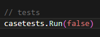
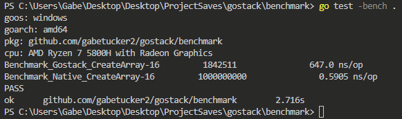

 <h1>Testing Tutorial</h1>

 <h2>Overview</h2>

 Hi there.  Welcome to the testing tutorial!  Here, we detail how you might go about running case tests/benchmarks for gostack.

 <h2>First Step</h2>

 Say you wanted to double-check that our case tests of the library are working properly, or perhaps you wanted to add your own case tests for debugging purposes.  Or, perhaps you would like to run our benchmarks on your computer.  In either a case, first:

 1. [Clone](https://github.com/git-guides/git-clone) this repository to your PC
 2. Open a terminal

 <h2>Case Tests/Test Script</h2>

 1. Enter the `executive` folder of your clone via your terminal
 2. Edit the `main()` function in `executive.go` to call your desired functions
 3. Type `go run .`
 4. See the output for each function call!

 <h3>Configuring Case Test Output</h3>

 If you'd like to configure the output of your case tests, enter `executive.go`...

 

 * Passing `true` into `casetests.Run` gives a detailed terminal output, useful for debugging and finding out which function is causing an error
 * Passing `false` into `casetests.Run` gives a concise terminal output, useful for quickly ensuring that everything is working properly

<h2>Benchmarks</h2>

 1. Enter the `benchmark` folder of your clone via your terminal
 2. Type `go test -bench .`
 3. See the output for each benchmark function test!

 

Look at the `ns/op` to compare speeds between ***gostack*** and ***native Go***.  This tells you the average time (in nanoseconds) each function call took.

---
 [> Return to glossary](../../README.md)
